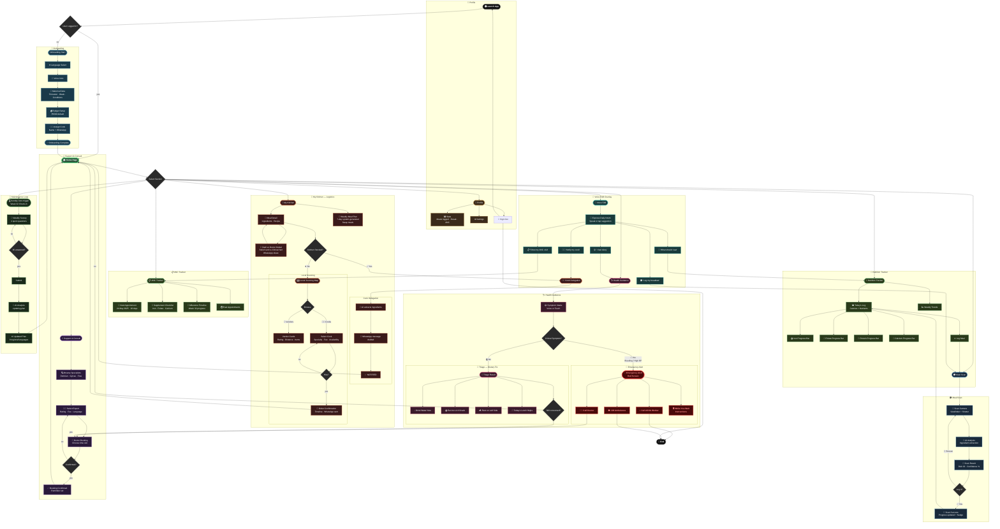

# Task Flow: MaaHealth

```mermaid
flowchart TD
    %% ── Entry ────────────────────────────────────────────────────
    START([🟢 Launch App])
    START --> AUTH{User Logged In?}

    AUTH -->|yes| HOME
    AUTH -->|no| OB_START

    %% ── Onboarding ───────────────────────────────────────────────
    subgraph ONBOARDING [🌱 Onboarding]
        direction TB
        OB_START([Onboarding Start])
        OB_START --> OB1[🌐 Language Select]
        OB1 --> OB2[🎤 Voice Intro]
        OB2 --> OB3[🤰 Maternal Data\nTrimester · Week · Conditions]
        OB3 --> OB4[💰 Budget Setup\n₹1500 default]
        OB4 --> OB5[👩‍🍳 Assign Cook\nName + WhatsApp]
        OB5 --> OB_DONE([✅ Onboarding Complete])
    end

    OB_DONE --> HOME

    %% ── Home ─────────────────────────────────────────────────────
    HOME([🏠 Home Page])
    HOME --> NAV{Select Section}

    NAV --> ANC_PAGE
    NAV --> NUTRITION_PAGE
    NAV --> SCAN_PAGE
    NAV --> SUPPORT_PAGE
    NAV --> PROFILE_PAGE
    NAV --> VOICE_PAGE
    NAV --> KITCHEN_PAGE
    NAV --> HEALTH_PAGE
    NAV --> SURVEY_PAGE

    %% ── ANC Tracker ──────────────────────────────────────────────
    subgraph ANC [📋 ANC Tracker]
        direction TB
        ANC_PAGE([📋 ANC Tracker])
        ANC_PAGE --> ANC1[📅 Next Appointment\n24 May 2025 · 18 days]
        ANC_PAGE --> ANC2[💊 Supplement Checklist\nIron · Folate · Calcium]
        ANC_PAGE --> ANC3[🏁 Milestone Timeline\nWeek 32 progress]
        ANC_PAGE --> ANC4[🕐 Past Appointments]
    end

    %% ── Nutrition Tracker ────────────────────────────────────────
    subgraph NUTRITION [🥗 Nutrition Tracker]
        direction TB
        NUTRITION_PAGE([🥗 Nutrition Tracker])
        NUTRITION_PAGE --> NT1[📊 Today's Log\nCalories + Nutrients]
        NUTRITION_PAGE --> NT2[📈 Weekly Trends]
        NT1 --> NT3[🩸 Iron Progress Bar]
        NT1 --> NT4[🌿 Folate Progress Bar]
        NT1 --> NT5[💪 Protein Progress Bar]
        NT1 --> NT6[🦴 Calcium Progress Bar]
        NT1 --> NT_LOG[➕ Log Meal] --> SCAN_PAGE
    end

    %% ── Meal Scan ────────────────────────────────────────────────
    subgraph SCAN [📷 Meal Scan]
        direction TB
        SCAN_PAGE([📷 Meal Scan])
        SCAN_PAGE --> SC1[📸 Scan Camera\nViewfinder + Shutter]
        SC1 --> SC2[🤖 AI Analysis\nIngredient extraction]
        SC2 --> SC3[🍛 Scan Result\nDish ID · Confidence %]
        SC3 --> SC4{Log it?}
        SC4 -->|✅ Yes| SC5[🎉 Scan Success\nProgress updated + Nudge]
        SC4 -->|🔄 Rescan| SC1
        SC5 --> NT1
    end

    %% ── Support & Consult ────────────────────────────────────────
    subgraph SUPPORT [💬 Support & Consult]
        direction TB
        SUPPORT_PAGE([💬 Support & Consult])
        SUPPORT_PAGE --> SP1[🔍 Browse Specialists\nDietician · Gynae · Free]
        SP1 --> SP2[👩‍⚕️ Select Expert\nRating · Fee · Language]
        SP2 --> SP3[📅 Doctor Booking\nChoose time slot]
        SP3 --> SP4{Confirmed?}
        SP4 -->|yes| SP5[✅ Booking Confirmed\nReminder set]
        SP4 -->|no| SP2
        SP5 --> HOME
    end

    %% ── Profile ──────────────────────────────────────────────────
    subgraph PROFILE [👤 Profile]
        direction TB
        PROFILE_PAGE([👤 Profile])
        PROFILE_PAGE --> PR1[📊 Stats\nMeals logged · Streak · ANC]
        PROFILE_PAGE --> PR2[⚙️ Settings]
        PROFILE_PAGE --> PR3[🚪 Sign Out] --> START
    end

    %% ── Voice FAB ────────────────────────────────────────────────
    subgraph VOICE [🎤 Voice FAB Overlay]
        direction TB
        VOICE_PAGE([🎤 Voice FAB])
        VOICE_PAGE --> VF1[💬 Express Daily Intent\nSpeak or tap suggestion]
        VF1 --> VF2[😵 'I feel dizzy'] --> HEALTH_PAGE
        VF1 --> VF3[📷 'Log my breakfast'] --> SCAN_PAGE
        VF1 --> VF4[👩‍🍳 'Notify my cook'] --> COOK
        VF1 --> VF5[📋 'Show my ANC visit'] --> ANC_PAGE
        VF1 --> VF6[🥗 'What should I eat'] --> NUTRITION_PAGE
    end

    %% ── My Kitchen / Logistics ───────────────────────────────────
    subgraph KITCHEN [🍳 My Kitchen — Logistics]
        direction TB
        KITCHEN_PAGE([🍳 My Kitchen])
        KITCHEN_PAGE --> MD[🍛 Meal Detail\nIngredients · Recipe]
        MD --> DADI[👵 Dadi vs Doctor Modal\nBelief card vs Clinical fact\nWhatsApp share]
        DADI --> MD
        MD --> STOCKED{Kitchen Stocked?}

        STOCKED -->|✅ Yes| COOK
        STOCKED -->|❌ No| SOURCING

        subgraph COOK_FLOW [Cook Delegation]
            direction TB
            COOK([👩‍🍳 Cook Delegation])
            COOK --> CK1[🤖 AI extracts ingredients]
            CK1 --> CK2[📲 WhatsApp message drafted]
            CK2 --> CK3[✅ NOTIFIED]
        end

        subgraph SOURCING_FLOW [Local Sourcing]
            direction TB
            SOURCING([🗺 Local Sourcing Map])
            SOURCING --> SRC1{Browse}
            SRC1 -->|🛒 Vendors| SRC2[Vendor Cards\nRating · Distance · Items]
            SRC1 -->|👩‍🍳 Cooks| SRC3[Select Cook\nSpecialty · Fee · Availability]
            SRC3 --> HIRE{Hire?}
            HIRE -->|yes| SRC4[🎉 Order Confirmation\nTimeline · WhatsApp sent]
            HIRE -->|no| SRC3
        end

        KITCHEN_PAGE --> WEEKLY[📅 Weekly Meal Plan\n7-day system-generated\nSwap meals]
    end

    CK3 --> HOME
    SRC4 --> HOME

    %% ── Health Guidance ──────────────────────────────────────────
    subgraph HEALTH [🩺 Health Guidance]
        direction TB
        HEALTH_PAGE([🩺 Health Guidance])
        HEALTH_PAGE --> SYM[😷 Symptom Intake\nVoice or Touch]
        SYM --> CRIT{Critical Symptom?}

        CRIT -->|🔴 Yes\nBleeding / High BP| EMERG
        CRIT -->|🟡 No| TRIAGE

        subgraph EMERGENCY_FLOW [🚨 Emergency Alert]
            direction TB
            EMERG([🚨 Emergency Alert\nRed Screen])
            EMERG --> EM1[📞 Call ASHA Worker]
            EMERG --> EM2[👨‍⚕️ Call Doctor] --> SP3
            EMERG --> EM3[🚑 108 Ambulance]
            EMERG --> EM4[⏳ While You Wait\nInstructions]
        end

        subgraph TRIAGE_FLOW [🌿 Triage — Dietary Fix]
            direction TB
            TRIAGE([🌿 Triage Result])
            TRIAGE --> TR1[💧 Drink Water Now]
            TRIAGE --> TR2[🩸 Eat Iron-rich Snack]
            TRIAGE --> TR3[🛋 Rest on Left Side]
            TRIAGE --> TR4[🍲 Today's Lunch Helps]
            TRIAGE --> TR5{Still concerned?}
            TR5 -->|yes| SP3
            TR5 -->|no| HOME
        end
    end

    %% ── Weekly Survey ────────────────────────────────────────────
    subgraph MAINTENANCE [🔄 Maintenance Loop]
        direction TB
        SURVEY_PAGE([🗓 Sunday Auto-trigger\nWeek 32 Check-in])
        SURVEY_PAGE --> WS1[📝 Weekly Survey\n4 quick questions]
        WS1 --> WS2{All answered?}
        WS2 -->|no| WS1
        WS2 -->|yes| WS3[Submit]
        WS3 --> WS4[🤖 AI Analysis\nUpdating plan]
        WS4 --> WS5[🌐 Updated Plan\n9 regional languages]
        WS5 --> HOME
    end

    %% ── End ──────────────────────────────────────────────────────
    EM1 --> DONE([🔴 End])
    EM3 --> DONE
    PR3 --> DONE

    %% ── Styles ───────────────────────────────────────────────────
    classDef home      fill:#2D5A3D,stroke:#4ADE80,stroke-width:2px,color:#FFFFFF,font-weight:bold
    classDef onboard   fill:#1A3A4A,stroke:#60A0C0,stroke-width:1.5px,color:#FFFFFF
    classDef nutrition fill:#2A3A1A,stroke:#7BBF8A,stroke-width:1.5px,color:#FFFFFF
    classDef scan      fill:#1A2A3A,stroke:#60A0D0,stroke-width:1.5px,color:#FFFFFF
    classDef support   fill:#2A1A3A,stroke:#A070D0,stroke-width:1.5px,color:#FFFFFF
    classDef profile   fill:#3A2A1A,stroke:#C09050,stroke-width:1.5px,color:#FFFFFF
    classDef voice     fill:#1A3A3A,stroke:#40C0C0,stroke-width:1.5px,color:#FFFFFF
    classDef kitchen   fill:#3A1A1A,stroke:#D07050,stroke-width:1.5px,color:#FFFFFF
    classDef health    fill:#3A1A2A,stroke:#D05080,stroke-width:1.5px,color:#FFFFFF
    classDef emergency fill:#4A0A0A,stroke:#FF4040,stroke-width:2px,color:#FF9090,font-weight:bold
    classDef maintain  fill:#1A2A1A,stroke:#80C080,stroke-width:1.5px,color:#FFFFFF
    classDef decision  fill:#2A2A2A,stroke:#888888,stroke-width:1.5px,color:#FFFFFF
    classDef terminal  fill:#111111,stroke:#444444,color:#FFFFFF,font-weight:bold

    class HOME home
    class OB_START,OB1,OB2,OB3,OB4,OB5,OB_DONE onboard
    class NUTRITION_PAGE,NT1,NT2,NT3,NT4,NT5,NT6,NT_LOG nutrition
    class SCAN_PAGE,SC1,SC2,SC3,SC5 scan
    class SUPPORT_PAGE,SP1,SP2,SP3,SP5 support
    class PROFILE_PAGE,PR1,PR2 profile
    class VOICE_PAGE,VF1,VF2,VF3,VF4,VF5,VF6 voice
    class KITCHEN_PAGE,MD,DADI,COOK,CK1,CK2,CK3,SOURCING,SRC2,SRC3,SRC4,WEEKLY kitchen
    class ANC_PAGE,ANC1,ANC2,ANC3,ANC4 nutrition
    class HEALTH_PAGE,SYM,TRIAGE,TR1,TR2,TR3,TR4,TR5 health
    class EMERG,EM1,EM2,EM3,EM4 emergency
    class SURVEY_PAGE,WS1,WS3,WS4,WS5 maintain
    class AUTH,NAV,STOCKED,SC4,CRIT,HIRE,SP4,SRC1,WS2,TR5 decision
    class START,DONE terminal
```
